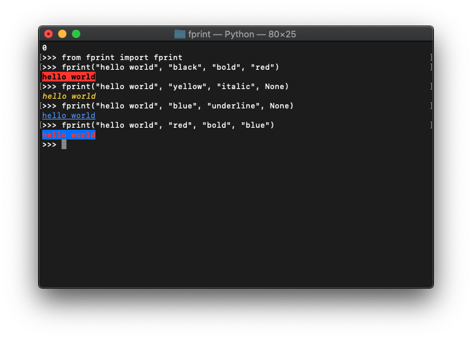
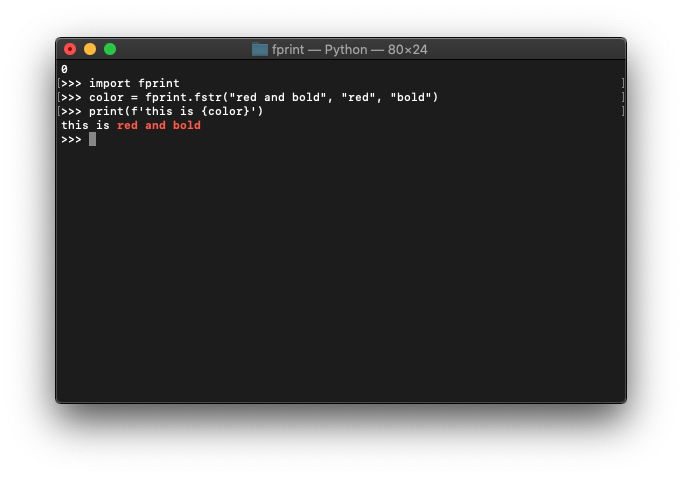
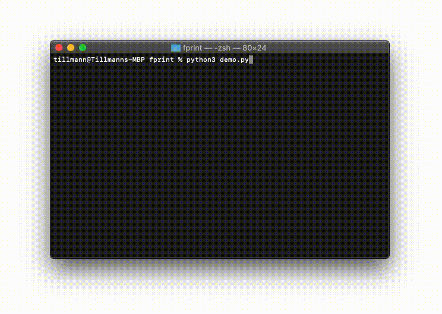

# fprint
Formatted printing in Python


## Usage

#### Formatted printing:
```python
from fprint import *

fprint(<"text">, <"text color">, <"text style">, <"background color">)
```

<p align="center">
  
</p>

#### Formatted Strings:
```python
import fprint

color = fprint.fstr("red and bold", "red", "bold")
print(f'this is {color}')
```
<p align="center">
  
</p>

#### Replace last printed line line:
```python
import fprint
import time

fprint.fprint("Hello", "red")
time.sleep(1)

fprint.prev()
fprint.fprint("World", "blue", "italic")
```
<p align="center">
  
</p>

### Colors

- black
- red
- green
- yellow
- blue
- purple
- cyan
- white

### Styles

- bold
- underline
- italic
- blink
